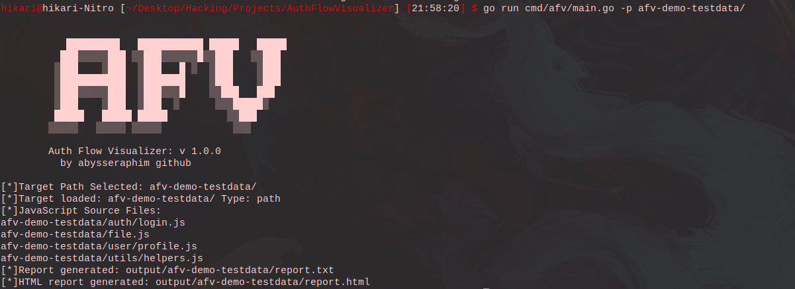
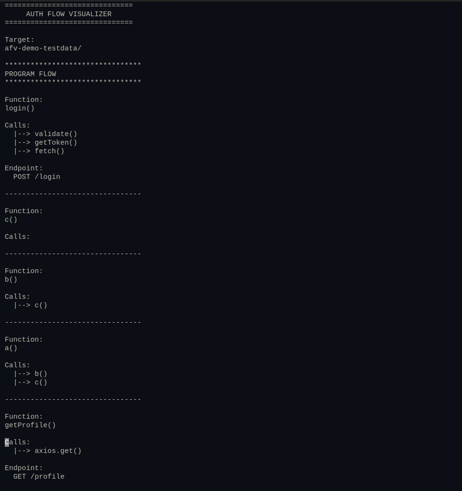
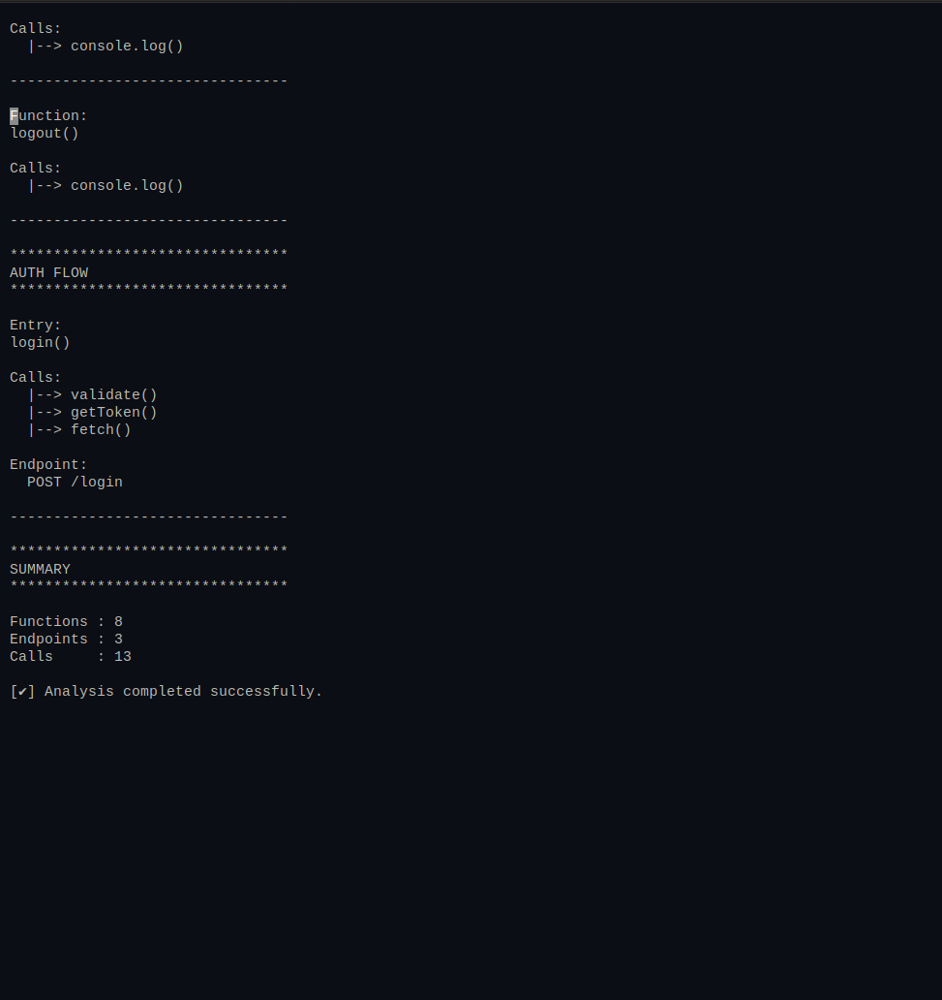
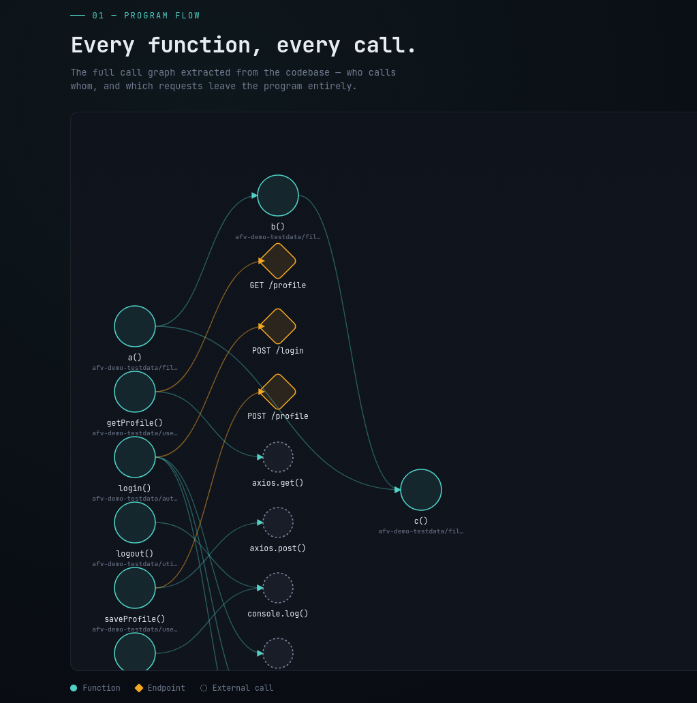
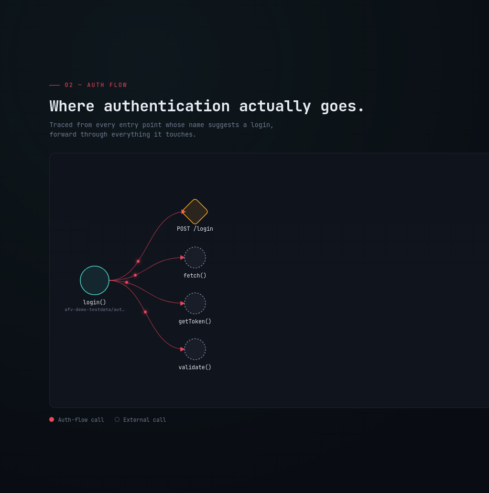

# Auth Flow Visualizer (AFV)

A lightweight static analysis tool for JavaScript applications that extracts authentication-related behavior and builds simplified Program Flow and Authentication Flow reports.

AFV is designed for security researchers, Application Security engineers, and penetration testers who want to understand authentication logic without manually reading thousands of lines of JavaScript.



---

## Features

- Parse JavaScript source code using Babel
- Normalize Babel AST into a simplified internal representation
- Discover:
  - Functions
  - API Endpoints
  - Function Calls
- Generate a Program Call Graph
- Generate an Authentication Flow Graph
- Produce a human-readable CLI report
- Analyze:
  - Local JavaScript source code (recommended)
  - Remote website URLs (experimental, headless browser supported)

---

## Architecture

```
 Path / URL
      │
      ▼
    Input
      │
      ▼
  Collector
      │
      ▼
 Babel Parser
      │
      ▼
 Normalizer
      │
      ▼
  Analyzer
      │
      ▼
 Flow Builder
      │
      ▼
    Report
```

---

## Project Structure

```
cmd/
    afv/

internal/
    analyzer/
    collector/
    input/
    model/
    parser/
    parser-side/
    progress/
    report/

afv-demo-testdata/
```

---

## Requirements

- Go 1.22+
- Node.js
- npm

---

## Dependencies

### Go

- golang.org/x/net/html

### Node.js

- @babel/parser

---

## Installation

Clone the repository:

```bash
git clone https://github.com/abysseraphim/AuthFlowVisualizer.git
cd AuthFlowVisualizer
```

Install the Node.js dependencies:

```bash
go mod tidy

cd internal/parser-side
npm install
cd ../..
```

---

## Build

```bash
go build -o afv ./cmd/afv
```

The executable should always be run from the project root because AFV invokes the embedded Node.js Babel parser located under:

```
internal/parser-side/
```

---

## Usage

AFV accepts one of the following targets:

- Local JavaScript source code directory
- Remote website URL (experimental)

Examples:

Analyze a local project:

```bash
./afv -p ./afv-demo-testdata
```

Analyze a remote website:

```bash
./afv -u example.com
```

Without building:

```bash
go run cmd/afv/main.go -p ./afv-demo-testdata
```

> URL mode attempts to use a headless Chrome/Chromium browser if available on the system, falling back to static HTTP fetch if not found.

---

## Screenshots

### CLI

  


### GUI Generated Report

  


---

## Current Capabilities

- Function discovery
- Endpoint discovery
- Internal function call detection
- External function call detection
- Program Call Graph generation
- Authentication Flow extraction (20+ auth-related keywords)
- CLI report generation
- HTML (GUI) report generation
- Progress indicators for each analysis stage
- Headless browser support for URL mode

---

## Project Status

AFV is currently an early MVP focused on validating the overall architecture.

The current implementation aims to provide a lightweight foundation that can evolve through future development and community contributions.

---

## Current Limitations

Some advanced JavaScript features are intentionally out of scope, including:

- Dynamic imports
- Runtime-generated code
- Alias resolution
- Cross-file symbol resolution
- Complete control-flow analysis
- Data-flow analysis

---

## Future Roadmap

- Interactive graph visualization
- Cross-file function resolution
- Source-to-Sink analysis
- Data-flow tracking
- Authentication pattern detection
- Additional JavaScript syntax support

---

## Contributing

This project is currently an MVP.

Suggestions, bug reports, and pull requests are always welcome.

If you have ideas for improving AFV, feel free to open an Issue or submit a Pull Request.

---

## License

This project is licensed under the MIT License.

---

## Acknowledgements

This project was designed and implemented by the author.

AI assistance was used for parts of the HTML report implementation (`internal/report/html.go`) and some enhancements in v1.1. All project architecture, analysis pipeline, parser integration, graph construction, and reporting logic were designed and integrated by the author.

---

## Author

**Soroush Maleki**

GitHub:

https://github.com/abysseraphim
